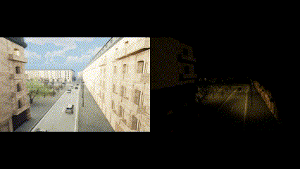

# 🕹️ Synthetic data generator

### 📁 Table of Contents

* <a href="#general">General</a>
* <a href="#requirements">Requirements</a>
    * <a href="#collections-and-plugins">Collections and plugins</a>
    * <a href="#expected-tree">Expected tree</a>
* <a href="#configuration">Configuration</a>
* <a href="#contributors">Contributors</a>

### 🏙️ General

This repository generates __synthetic data of Paris__ from [OpenStreetMap](https://www.openstreetmap.org) data and animates it with the [City Sample](https://www.unrealengine.com/marketplace/en-US/product/city-sample) project (pedestrians, cars). 
The synthetic data is captured in several formats (RGB and semantic).<br/>

The objective is to detect AI models biases from this synthetic data. For instance, detect if our crowd counting model is efficient either day and night by submitting two datasets.

### 🧰 Requirements

- [Unreal Engine 5.1.1](https://www.unrealengine.com/fr/unreal-engine-5)

#### Collections and plugins

In your project, you will need to add:

- [City Sample Crowds](https://www.unrealengine.com/marketplace/en-US/product/city-sample-crowds)
- [City Sample Vehicles](https://www.unrealengine.com/marketplace/en-US/product/city-sample-vehicles)

#### Expected tree

```bash
. [Twincity]
└── Content # Download from the marketplace 👇
  └── City Sample Crowds
  └── City Sample Vehicles
├── [...]
└── Plugins # Create a Plugins folder where you can clone EasySynth repository 👇
    └── EasySynth
```

#### Demo

##### Day and night scenes

<p align="center">
	
</p>

##### Weather

<p align="center">
	
</p>

##### Camera angles and semantic views

<p align="center">
	
</p>

Semantic views is useful in computer vision to detect objects (pedestrians, buildings, roads, vehicles etc).

<p align="center">
	
</p>

##### Crowd generator

<p align="center">
	
</p>

<p align="center">
	
</p>

##### Extractor results

Once the user has clicked on "Generate", RGB and semantic datas can be found in /d/Snapchot/ folder. Metadatas file describing screenshots (number of vehicles and peds, peds id and RGB, camera rotation/location, weather...) is also created in /d/.

<p align="center">
	
</p>

### 👋 Contributors

- Lead Dev - [Jehanne Dussert](https://github.com/JehanneDussert/)
- Dev - [Rémi Giner](https://github.com/remisansfamine/)
- Dev - [Nobila Traore](https://github.com/notraore/)
- Game Artist - [William Lahemar](https://github.com/willocks)
